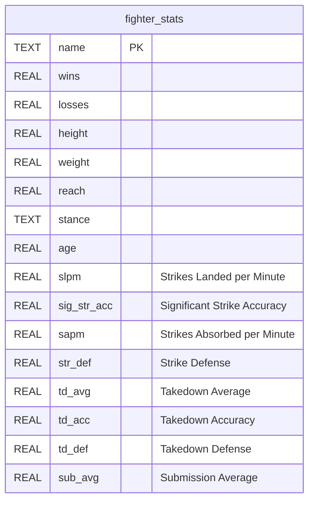
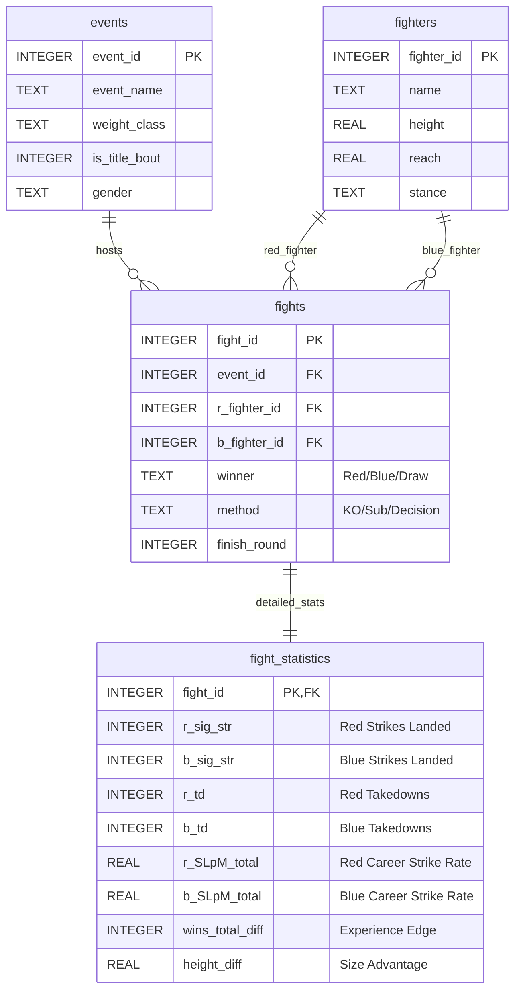

# UFC Database ER Diagrams

## Database 1: ufc_database.db (Simple Fighter Stats)

---

## Database 2: normalized_ufc.db (Normalized Fight Data - 3NF)

```mermaid
erDiagram
    events ||--o{ fights : "hosts"
    fighters ||--o{ fights : "red_corner"
    fighters ||--o{ fights : "blue_corner"
    fights ||--|| fight_statistics : "has_stats"
    
    events {
        INTEGER event_id PK
        TEXT event_name
        TEXT weight_class
        INTEGER is_title_bout
        TEXT gender
        TEXT referee
        REAL total_rounds
    }
    
    fighters {
        INTEGER fighter_id PK
        TEXT name
        REAL height
        REAL reach
        TEXT stance
    }
    
    fights {
        INTEGER fight_id PK
        INTEGER event_id FK
        INTEGER r_fighter_id FK "Red Corner Fighter"
        INTEGER b_fighter_id FK "Blue Corner Fighter"
        TEXT winner
        TEXT method
        INTEGER finish_round
        INTEGER time_sec
    }
    
    fight_statistics {
        INTEGER fight_id PK,FK
        INTEGER r_kd "Red Knockdowns"
        INTEGER r_sig_str "Red Sig Strikes"
        INTEGER r_sig_str_att "Red Sig Strike Attempts"
        REAL r_sig_str_acc "Red Sig Strike Accuracy"
        INTEGER r_str "Red Total Strikes"
        INTEGER r_str_att "Red Strike Attempts"
        REAL r_str_acc "Red Strike Accuracy"
        INTEGER r_td "Red Takedowns"
        INTEGER r_td_att "Red TD Attempts"
        REAL r_td_acc "Red TD Accuracy"
        INTEGER r_sub_att "Red Submission Attempts"
        INTEGER r_rev "Red Reversals"
        INTEGER r_ctrl_sec "Red Control Time"
        INTEGER r_wins_total "Red Total Wins"
        INTEGER r_losses_total "Red Total Losses"
        REAL r_age "Red Age"
        REAL r_weight "Red Weight"
        REAL r_SLpM_total "Red Career SLpM"
        REAL r_SApM_total "Red Career SApM"
        REAL r_sig_str_acc_total "Red Career Accuracy"
        REAL r_td_acc_total "Red Career TD Acc"
        REAL r_str_def_total "Red Career Defense"
        REAL r_td_def_total "Red Career TD Def"
        REAL r_sub_avg "Red Submission Avg"
        REAL r_td_avg "Red Takedown Avg"
        INTEGER b_kd "Blue Knockdowns"
        INTEGER b_sig_str "Blue Sig Strikes"
        INTEGER b_sig_str_att "Blue Sig Strike Attempts"
        REAL b_sig_str_acc "Blue Sig Strike Accuracy"
        INTEGER b_str "Blue Total Strikes"
        INTEGER b_str_att "Blue Strike Attempts"
        REAL b_str_acc "Blue Strike Accuracy"
        INTEGER b_td "Blue Takedowns"
        INTEGER b_td_att "Blue TD Attempts"
        REAL b_td_acc "Blue TD Accuracy"
        INTEGER b_sub_att "Blue Submission Attempts"
        INTEGER b_rev "Blue Reversals"
        INTEGER b_ctrl_sec "Blue Control Time"
        INTEGER b_wins_total "Blue Total Wins"
        INTEGER b_losses_total "Blue Total Losses"
        REAL b_age "Blue Age"
        REAL b_weight "Blue Weight"
        REAL b_SLpM_total "Blue Career SLpM"
        REAL b_SApM_total "Blue Career SApM"
        REAL b_sig_str_acc_total "Blue Career Accuracy"
        REAL b_td_acc_total "Blue Career TD Acc"
        REAL b_str_def_total "Blue Career Defense"
        REAL b_td_def_total "Blue Career TD Def"
        REAL b_sub_avg "Blue Submission Avg"
        REAL b_td_avg "Blue Takedown Avg"
        INTEGER kd_diff "Knockdown Difference"
        INTEGER sig_str_diff "Sig Strike Difference"
        INTEGER sig_str_att_diff "Sig Strike Att Diff"
        REAL sig_str_acc_diff "Sig Strike Acc Diff"
        INTEGER str_diff "Strike Difference"
        INTEGER str_att_diff "Strike Attempt Diff"
        REAL str_acc_diff "Strike Accuracy Diff"
        INTEGER td_diff "Takedown Difference"
        INTEGER td_att_diff "TD Attempt Diff"
        REAL td_acc_diff "TD Accuracy Diff"
        INTEGER sub_att_diff "Submission Att Diff"
        INTEGER rev_diff "Reversal Difference"
        INTEGER ctrl_sec_diff "Control Time Diff"
        INTEGER wins_total_diff "Total Wins Diff"
        INTEGER losses_total_diff "Total Losses Diff"
        REAL age_diff "Age Difference"
        REAL height_diff "Height Difference"
        REAL weight_diff "Weight Difference"
        REAL reach_diff "Reach Difference"
        REAL SLpM_total_diff "Career SLpM Diff"
        REAL SApM_total_diff "Career SApM Diff"
        REAL sig_str_acc_total_diff "Career Acc Diff"
        REAL td_acc_total_diff "Career TD Acc Diff"
        REAL str_def_total_diff "Career Defense Diff"
        REAL td_def_total_diff "Career TD Def Diff"
        REAL sub_avg_diff "Submission Avg Diff"
        REAL td_avg_diff "Takedown Avg Diff"
    }
```

---

## Simplified Normalized Database Diagram (Key Fields Only)

---

## Database Relationships Explained

### ufc_database.db
- **Single table design** for quick fighter lookups
- Contains **2,479 fighters** with career statistics
- Used for: Fighter profile searches, prediction input

### normalized_ufc.db  
- **3NF (Third Normal Form)** design for data integrity
- Contains **7,439 fights** with detailed statistics
- **4 tables** with foreign key relationships:
  - `events` → Event metadata
  - `fighters` → Fighter profiles
  - `fights` → Fight outcomes (links to events and fighters)
  - `fight_statistics` → Detailed per-fight stats
- Used for: ML training, analysis, reporting

### Key Relationships:
1. **One Event → Many Fights**: Each UFC event hosts multiple fights
2. **One Fighter → Many Fights**: Each fighter participates in multiple fights
3. **One Fight → One Statistics Record**: Each fight has detailed stats
4. **Each Fight has TWO fighters**: Red corner and Blue corner (self-referencing relationship)

---

## Usage Notes

**For predictions**: Use `ufc_database.db` (simple, fast lookups)

**For training models**: Use `normalized_ufc.db` (comprehensive fight history)

**For analytics**: Use `normalized_ufc.db` (join tables for complex queries)
